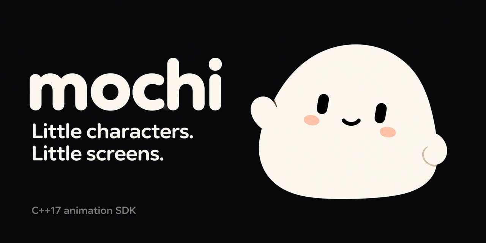
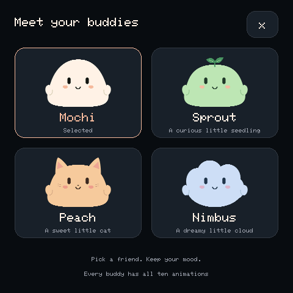

# Mochi



**Little characters for little screens.** Mochi is an open-source C++17 animation SDK and a touchscreen playground for embedded displays. Give a character a mood, advance its animation, and draw it into an RGB565 framebuffer.

The original cream-colored **Mochi** is the project's mascot and brand mark.
See the [brand assets](docs/brand/README.md) for the master artwork and repository cover.

The core runs without Arduino, a graphics framework, network access, or an account. The included adapter brings it to the **Waveshare ESP32-S3-Touch-AMOLED-2.16**. The [browser playground and documentation](https://mochi.prabhavalabs.com/) let you explore all four characters without hardware.

**Version 0.3.0.** This is an early SDK: source compatibility may change before 1.0. Packages are consumed from this repository and are not yet published to a package registry.

[Quick start](#quick-start) · [Hardware setup](#run-on-the-waveshare-board) · [Integration guide](docs/INTEGRATION.md) · [API guide](sdk/Mochi/README.md) · [Contributing](CONTRIBUTING.md) · [Security](SECURITY.md)

## Features and characters


- Four procedural characters with distinct silhouettes and editable colors.
- Ten states: **Idle, Blinking, Happy, Listening, Thinking, Speaking, Sleeping, Surprised, Sad, Waving**.
- Smooth transitions, independent eyes/hands/mouth, manual blinks, pause and speed controls.
- Optional mouth movement driven by a normalized speech level from your application.
- Allocation-free animation and rendering into an application-owned buffer.
- Independent character instances, temporary reactions, and commands from application events.
- Clipped widgets in existing screens, optional task queues, and small-buffer rendering.
- Configurable tap/swipe recognition, including lost-release handling.
- A touchscreen example with character and mood pickers, tour mode, and USB commands.

| Character | Design |
| --- | --- |
| **Mochi** | The original cream-colored buddy |
| **Sprout** | A curious mint seedling with two leaves |
| **Peach** | A sweet peach-colored cat with ears and whiskers |
| **Nimbus** | A dreamy blue cloud with a scalloped outline |

Every character supports every state. Switching appearance preserves the animator's mood, elapsed time, pause setting and pace.

## Quick start

```sh
git clone https://github.com/prabhavalabs/mochi.git
cd mochi
```

| Goal | Requirements |
| --- | --- |
| Browser preview | Node.js 22.12+ and a modern browser |
| Portable SDK | CMake 3.16+ and a C++17 compiler |
| Touchscreen demo | Supported Waveshare board, USB data cable, PlatformIO |

### Browser preview — no board required

```sh
npm ci
npm run dev
```

Open **http://127.0.0.1:4321**. The Astro portal includes all four companions,
ten animation states, local documentation search, and light/dark themes that follow
your system. Character selection changes the name, personality, accent colors,
and subtle browser motion pace, and persists across documentation pages.

Tap to blink, swipe to change states, or use the keyboard-accessible controls.
Reduced-motion settings start the preview paused; Play enables animation.
Speaking is visual only. The browser does not communicate with the board and is
not a packaged React SDK.

```sh
npm run check:site
npm run build
npm run test:site
npm run preview
```

The production site is available at [mochi.prabhavalabs.com](https://mochi.prabhavalabs.com/) and deployed with Cloudflare Pages.
See [website maintenance](site/src/content/docs/website.md) and
[deployment](site/src/content/docs/deployment.md) for content authoring, components,
characters, themes, validation, and custom-domain settings. Fonts and assets are
self-hosted; no analytics or account is required.

The original dependency-free Mochi demo remains in `web/`. Use
`npm run dev:legacy` to serve it at port 4173 without installing dependencies.

### Portable SDK — no Arduino required

Install CMake and a C++17 compiler: Clang from Xcode Command Line Tools on macOS, Clang/GCC on Linux, or Visual Studio's C++ tools on Windows.

```sh
cmake -S sdk/Mochi -B build/sdk \
  -DMOCHI_BUILD_TESTS=ON -DMOCHI_BUILD_EXAMPLE=ON
cmake --build build/sdk --config Release
ctest --test-dir build/sdk -C Release --output-on-failure
```

Render standalone images on macOS/Linux:

```sh
./build/sdk/mochi_offscreen build/mochi.ppm
./build/sdk/mochi_cast build/characters.ppm
./build/sdk/mochi_application build/application.ppm
./build/sdk/mochi_stripes build/stripes.ppm
```

Visual Studio generators put executables under `build/sdk/Release/` with an `.exe` suffix. Open the output with a PPM-capable viewer or convert it to PNG. The cast example renders all four characters from the same pose. The application example embeds two independent widgets; the stripe example renders with only eight rows of pixel storage.

## Run on the Waveshare board

### Supported hardware

The adapter targets the [Waveshare ESP32-S3-Touch-AMOLED-2.16](https://docs.waveshare.com/ESP32-S3-Touch-AMOLED-2.16):

| Component | Configuration |
| --- | --- |
| MCU and memory | ESP32-S3, 16 MB flash, 8 MB OPI PSRAM |
| Display | CO5300, 480 × 480 RGB565 AMOLED over QSPI |
| Touch | CST9220 capacitive touchscreen |
| Power | AXP2101 PMIC |
| Orientation | USB connector at the bottom |

Use this exact board profile. Other ESP32-S3 displays can have different pins, controllers and memory. To support another board, keep the portable core and write an adapter; see [Porting](docs/PORTING.md).

### 1. Install PlatformIO

Follow the [PlatformIO Core installation guide](https://docs.platformio.org/en/latest/core/installation/index.html), or use PlatformIO IDE's integrated terminal. The commands below assume `pio` is on your PATH.

For a standalone macOS/Linux environment, Python 3.11 or 3.12 is a practical choice:

```sh
python3 -m venv .venv
source .venv/bin/activate
python -m pip install platformio==6.1.19
pio --version
```

In Windows PowerShell, activate with `.venv\Scripts\Activate.ps1` instead of `source`. The first build downloads the embedded compiler and dependencies, requiring internet access and several minutes.

### 2. Build

From the repository root:

```sh
pio run --project-dir firmware
```

The configuration pins pioarduino `55.03.38-1` / Arduino-ESP32 `3.3.8`, Arduino_GFX `1.6.7`, SensorLib `0.2.6`, and XPowersLib `0.2.7`. Both local SDK packages are linked automatically. No credentials or environment file are required.

### 3. Identify and flash the board

Connect using a USB **data** cable:

```sh
pio device list
```

Identify the Espressif interface (`303A:1001` on the tested board). macOS commonly uses `/dev/cu.usbmodem…`, Linux `/dev/ttyACM…`, and Windows `COM…`. Replace `YOUR_PORT` with your device's port:

```sh
pio run --project-dir firmware --target upload --upload-port YOUR_PORT
pio device monitor --port YOUR_PORT --baud 115200
```

Flashing replaces the application currently installed on the board. Back up firmware and settings you want to keep first. Normal upload does not intentionally erase the entire flash.

If serial upload cannot enter download mode, use the [USB JTAG and recovery guide](firmware/FLASHING.md). Built-in USB JTAG has been tested at a 20 MHz adapter clock.

### 4. Explore



| Control | Action |
| --- | --- |
| Character name, top left | Open character picker |
| Swipe left/right or bottom arrows | Next/previous state |
| Choose a mood | Select any of ten states |
| Tap the character | Blink while animation is playing |
| Tour | Cycle moods every 5.5 animation seconds |
| Mood picker controls | Pause/play, tour, and 0.5× / 1× / 1.5× pace |
| Physical +/KEY and BOOT/− | Next/previous mood while firmware runs |
| PWR | Board power control |

The selection resets to Mochi after reboot. Opening a picker suspends animation and the tour until it closes. All characters use the same controls.

### USB commands

Send printable ASCII terminated by a newline at 115200 baud. CRLF is supported. Lines longer than 63 characters, or containing nonprintable bytes other than CR/LF, are discarded.

| Command | Meaning |
| --- | --- |
| `status` | JSON: version, display/touch/PMIC readiness, PSRAM, character, state, view, FPS and timing |
| `character 0` … `character 3` | Mochi, Sprout, Peach, Nimbus |
| `state 0` … `state 9` | Idle, Blinking, Happy, Listening, Thinking, Speaking, Sleeping, Surprised, Sad, Waving |
| `trigger 2 1.5` | Happy for 1.5 animation seconds, then return to the selected base state; accepts any state number and duration in `(0, 86400]` |
| `cancel` | End the temporary reaction and return to the base state |
| `menu characters` / `menu moods` / `menu close` | Show or close a picker |
| `tour on` / `tour off` | Enable/disable mood cycling |
| `pause` / `play` | Freeze/resume animation |

The console also emits startup and selection messages: look for JSON lines when requesting `status`. FPS counts rendered frames over the latest interval; a static menu or paused character can correctly report zero.

## Use the SDK in your project

| Package | Provides | Requires |
| --- | --- | --- |
| [`Mochi`](sdk/Mochi/README.md) | Character instances, timed reactions, commands, poses, RGB565 rendering, palettes, gestures | C++17 standard library |
| [`MochiWaveshare216`](sdk/MochiWaveshare216/README.md) | Display, touch, power initialization and PSRAM framebuffer | Arduino-ESP32 and pinned drivers |

For CMake:

```cmake
add_subdirectory(path/to/mochi/sdk/Mochi)
target_link_libraries(your_application PRIVATE Mochi::Mochi)
```

The core also supports installation with `cmake --install` and consumption with
`find_package(Mochi 0.3 CONFIG REQUIRED)`. See the [integration guide](docs/INTEGRATION.md#install-the-sdk-independently)
for a standalone installation that does not depend on this checkout.

For PlatformIO, link a local clone and enable C++17:

```ini
lib_deps = symlink:///absolute/path/to/mochi/sdk/Mochi
build_unflags = -std=gnu++11
build_flags = -std=gnu++17
```

Include both packages for the Waveshare adapter; its guide has a complete configuration. This repository contains multiple packages, so use their directories rather than installing the repository root as one library.

### Minimal rendering loop

```cpp
#include <Mochi.h>
#include <array>

// Keep the buffer in long-lived storage, not a small embedded task stack.
constexpr int width = 320, height = 320;
std::array<uint16_t, width * height> pixels{};
mochi::Mascot buddy;
mochi::Surface screen{pixels.data(), pixels.size(), width, height};

void setupCharacter() {
    buddy.setCharacter(mochi::Character::Sprout);
    buddy.setState(mochi::State::Thinking);
}

void frame(float elapsedSeconds) {
    buddy.update(elapsedSeconds);
    mochi::Renderer(screen).clear();
    buddy.draw(screen, 160, 160, 0.8f);
    // Present pixels with your display driver.
}
```

The core borrows your buffer and does not present it. Capacity and stride are in **pixels**; colors use native-endian `uint16_t` RGB565. A 320 × 320 buffer uses 204,800 bytes; the 480 × 480 board buffer uses 460,800 bytes of PSRAM.

### Trigger it from your application

Call these from the task that owns the character, whenever application events occur:

```cpp
buddy.setState(mochi::State::Idle);       // Normal activity.
buddy.trigger(mochi::State::Happy, 1.5f); // React, then resume Idle.
buddy.blink();
```

Create as many instances as your memory/frame budget allows. Each owns its character,
colors, playback and reaction timer. A `sub_surface()` view keeps drawing inside a
widget in your existing screen. No picker, global singleton, display driver or
background task is required by the core.

For events from another task, send `mochi::Command` values to the UI task. The optional
`CommandQueue<N>` supports one producer and one consumer; an RTOS queue supports
multiple producers. The [complete integration guide](docs/INTEGRATION.md) explains
ownership, timing, visibility, small buffers and GUI integration. The
[FreeRTOS application](examples/freertos_companion/README.md) demonstrates two widgets
and worker events without the playground's controls.

### Playback and colors

```cpp
buddy.blink();
buddy.setPaused(true);
buddy.setSpeed(0.5f);                   // Finite range: 0.1 to 4.0.
buddy.setState(mochi::State::Speaking);
buddy.setSpeechLevel(0.65f);            // 0..1 mouth opening; no audio playback.
buddy.setPaused(false);
buddy.clearSpeechLevel();              // Restore automatic mouth animation.

auto colors = mochi::default_palette(mochi::Character::Sprout);
colors.body = mochi::rgb565(0xB8E8D0);
buddy.setPalette(colors);
```

Pass elapsed **seconds** to `update()`. Each update consumes at most 100 ms before applying speed, preventing large jumps after stalls. Use a single animation/UI task; queue commands from other tasks.

Selecting a different character loads its default palette; apply custom colors afterward. Selecting the current character preserves its palette. The [full API guide](sdk/Mochi/README.md) covers callbacks, validation, clipping, gestures and buffer lifetime.

## Development and tests

```sh
npm ci
npm run check:site
npm run build
npm run test:site
npm run check
npm run test:web
python3 scripts/test-sdk.py
python3 scripts/test-install.py
pio run --project-dir firmware
pio run --project-dir examples/freertos_companion
```

The sanitizer runner needs Python 3 and Clang on macOS/Linux; `CXX=g++` selects GCC where sanitizers are available. Windows users can use WSL or CMake/CTest. Tests cover reactions, callbacks, speech levels, all 40 character/state combinations, clipped subviews, bounded queues, stripe rendering, gestures and malformed USB lines. The install test requires CMake and builds a separate consumer after relocating the installation and removing its original source/build directories.

GitHub Actions runs portable and installed-package checks on Linux/macOS, browser/server checks, and both embedded application builds. These do not replace physical testing of orientation, touch, flashing or power. See [Contributing](CONTRIBUTING.md) for the hardware checklist.

### Project layout

```text
sdk/Mochi/                 Portable C++17 SDK, examples and tests
sdk/MochiWaveshare216/      Board adapter and dependency notices
firmware/                  PlatformIO application and native checks
examples/                  Independent embedded application integrations
site/                      Astro documentation and four-character playground
web/                       Legacy dependency-free reference for original Mochi
scripts/                   Local server and sanitizer runner
tests/                     Server regression tests
docs/                      Screenshots, integration and porting guides
```

Generated firmware, archives, local settings and device backups are not part of the source repository. Builds go under `firmware/.pio/` or your chosen CMake directory.

## Troubleshooting

| Symptom | What to check |
| --- | --- |
| `pio` not found | Activate the Python environment or use PlatformIO IDE's terminal. |
| No USB device | Try a data cable and another port; run `pio device list`. Follow vendor driver/permission instructions for your OS. |
| Upload times out | Close serial monitors; follow [recovery/JTAG steps](firmware/FLASHING.md). |
| Blank or red display | Confirm the exact board and 16 MB flash / 8 MB OPI PSRAM profile. Red indicates framebuffer allocation failure. Read startup messages. |
| Touch does not work | Check `status` for `touch: true`; keep USB at the bottom. Buttons and USB commands are alternate controls. |
| Character is still | Close the picker and press Play. Browser reduced-motion settings may start it paused. |
| Trails after porting | Clear the old drawing and present all affected rows. Bounds depend on scale, position and every pose. |
| Browser cannot connect | Keep `npm run dev` running; use the printed local URL. |

## Current limits

- Speaking/Listening are visual states. Audio, microphone capture, speech recognition and synthesis are not implemented.
- The board has an IMU; this adapter does not yet expose motion reactions, RTC, SD card or audio devices.
- Only the Waveshare 2.16-inch board has a tested hardware adapter. Other boards need integration work.
- The core targets C++17/RGB565 applications. Other languages, pixel formats and GUI lifecycles need an integration layer; compiled libraries must match the target toolchain.
- The example caps scheduling at 30 FPS. Actual performance depends on rendering and display transfer; idle measured approximately 18 FPS during development.
- The SDK has no Wi-Fi/Bluetooth services, cloud integrations, persistent settings or over-the-air updates.

## Community and license

Mochi is stewarded by **Prabhava Labs** and welcomes community maintenance: bugs, documentation, characters, tests and board ports. Read [Contributing](CONTRIBUTING.md), [Governance](GOVERNANCE.md), and the [Code of Conduct](CODE_OF_CONDUCT.md). Use [Issues](https://github.com/prabhavalabs/mochi/issues) for bugs/proposals and [private reporting](SECURITY.md) for vulnerabilities.

Project source, documentation and included character artwork use the [MIT License](LICENSE), except where a file carries a separate notice. Dependency licenses and preserved notices are described in [THIRD_PARTY_NOTICES.md](THIRD_PARTY_NOTICES.md).
